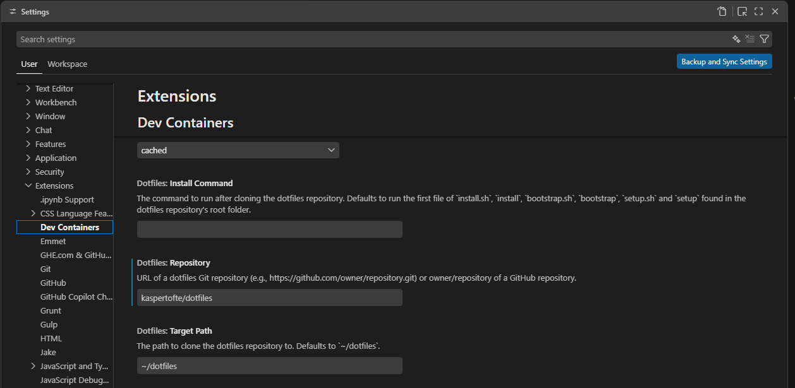

# Dotfiles

Small personal dotfiles setup for shell, Git, and VS Code extensions.

## Recommended: Dev Containers dotfiles setup

When using the VS Code Dev Containers extension, set this repo as your dotfiles repository. VS Code will clone/update it automatically, and your setup will re-run when you reload/rebuild the container.

In VS Code settings, set:

```json
{
   "dotfiles.repository": "kaspertofte/dotfiles",
   "dotfiles.targetPath": "~/dotfiles",
}
```




## Manual setup (fallback)

1. Clone this repo into `~/dotfiles`:

   ```bash
   git clone git@github.com:kaspertofte/dotfiles.git ~/dotfiles
   ```

2. Run the installer:

   ```bash
   bash ~/dotfiles/install.sh
   ```

3. Restart your terminal so `~/.bashrc` reloads.


## What the installer configures

- Adds `~/dotfiles/bash_aliases` as `~/.bash_aliases`.
- Appends `source ~/dotfiles/bashrc` to `~/.bashrc` (if missing).
- Adds an `[include]` entry in `~/.gitconfig` pointing to `~/dotfiles/gitconfig`.
- Installs personal VS Code extensions via `install-vscode-extensions.sh` when a usable VS Code CLI is available.
